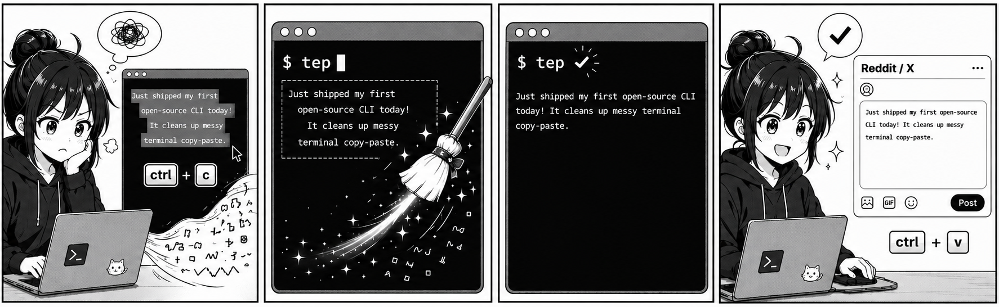

# tep — TUI Easy Paste

<p align="center">
  
</p>

[](README.md)
[](README.zh-CN.md)
[](LICENSE)
[](go.mod)
[](#)

从终端 / TUI(Claude Code、Codex CLI 等)里复制文本,粘到别处往往是乱的:每行
都带着界面的缩进、正文被硬折行截断、盒状边框和 ANSI 颜色码混进来。`tep` 把这些
清理干净,让你直接粘进 Reddit、X、文档或聊天框。

它会**自动识别 Markdown 和纯文本**,并分别处理:

- **纯文本** → 把被终端折行的句子重新拼回成干净的段落。
- **Markdown** → 保留结构:标题、列表项、引用、表格、围栏代码块都保持原有边界,
  只把块内被折行的正文重新拼接。代码块逐字保留。

## 快速开始

```sh
# 1. 安装
go install github.com/weijt606/TUI-easy-past/cmd/tep@latest

# 2. 像平常一样,从 TUI(Claude Code、Codex 等)里复制文本。

# 3. 原地清理剪贴板:
tep

# 4. 随便粘到哪里 —— 格式已经修好。
```

不想安装?一行管道直接处理(macOS):

```sh
pbpaste | tep - | pbcopy
```

## 日常使用流程

三步:

```text
①  在 TUI 里复制文本        (鼠标选中,再 ⌘C / Ctrl-Shift-C)
        │
        ▼
②  运行  tep                读取剪贴板、清理、再写回
        │
        ▼
③  粘贴到任意处             换行、缩进、边框都修好
                          (Reddit · X · 文档 · 聊天框)
```

`tep` 操作的是系统剪贴板,所以在任何 shell 里都能跑——新开一个终端标签当然可以。但
通常你连这个都不需要:

### 不用离开 Claude Code / Codex CLI 就能跑

**Claude Code** 和 **Codex CLI** 都支持以 `!` 开头的行内 shell 命令。所以复制完之后,
直接输入:

```
!tep
```

就能原地清理剪贴板——不用新开终端,也不用离开当前会话。然后切到你要粘贴的地方粘上即可。

- **Claude Code** —— `!tep` 在会话的 shell 里执行,执行完回到输入框。
- **Codex CLI** —— `!tep` 会按你的审批/沙箱设置执行,命令输出会回喂给对话。

## 安装

```sh
go install github.com/weijt606/TUI-easy-past/cmd/tep@latest   # 安装 `tep` 可执行文件
```

或从源码构建:

```sh
git clone https://github.com/weijt606/TUI-easy-past
cd TUI-easy-past
go build -o tep ./cmd/tep
```

无 cgo、无第三方依赖。剪贴板读写通过系统自带工具完成:`pbcopy`/`pbpaste`
(macOS)、`wl-copy`/`xclip`/`xsel`(Linux)、`clip`/`Get-Clipboard`(Windows)。

## 各平台说明

`tep` 是单个静态二进制,各平台只有剪贴板访问方式不同。

**macOS** —— 开箱即用(`pbpaste`/`pbcopy` 系统自带)。如果 `go install` 后找不到
`tep` 命令,把 Go 的 bin 目录加进 PATH:

```sh
export PATH="$PATH:$(go env GOPATH)/bin"
```

**Linux** —— 先装一个剪贴板辅助工具,之后 `tep` 用法一致:

```sh
sudo apt install wl-clipboard      # Wayland → wl-copy / wl-paste
sudo apt install xclip             # X11(或 xsel)

wl-paste | tep - | wl-copy                                   # Wayland 一行处理
xclip -selection clipboard -o | tep - | xclip -selection clipboard   # X11
```

**Windows** —— 使用系统自带的 `Get-Clipboard`(读)和 `clip`(写),无需额外安装。
在 PowerShell 里:

```powershell
tep                              # 原地清理剪贴板
Get-Clipboard | tep - | Set-Clipboard   # 显式管道
```

## 用法

日常流程就是三步:**在 TUI 里复制 → 运行 `tep` → 粘贴。** 不带参数的 `tep`
会读取剪贴板、清理、再写回。

```sh
tep                       # 原地清理剪贴板(最常用)
tep --dry-run             # 打印清理结果,不改动剪贴板
tep --explain             # 额外把识别到/改动了什么打印到 stderr
tep --markdown            # 自动识别猜错时,强制 Markdown 模式
pbpaste | tep - | pbcopy  # 用显式管道代替默认的原地处理
cat session.log | tep -   # 清理一份抓下来的日志,打印到 stdout
```

### 参数

| 参数 | 作用 |
|---|---|
| `-n`, `--dry-run` | 把结果打印到 stdout;不改动剪贴板。 |
| `--stdin`, `-` | 从标准输入读、写到标准输出。 |
| `--explain` | 把检测到的格式、剥离的边框、缩进等打印到 stderr。 |
| `--no-rejoin` | 只清理边框/空白,保留原有换行。 |
| `--keep-ansi` | 保留 ANSI 转义序列。 |
| `--markdown` | 强制 Markdown 模式(跳过自动识别)。 |
| `--plain` | 强制纯文本模式(跳过自动识别)。 |

## 处理流程(按顺序)

1. 规范化换行符,剥离 ANSI 转义。
2. 删除横向盒边框(`┌──┐`、`└──┘`);保留盒内空行作为空白行,避免丢失段落分隔。
3. 剥离作为边框的左右竖线(`│`、`|` 等)。
4. 去掉行尾空白,并去除公共的左缩进。
5. 识别 Markdown 还是纯文本。
6. 宽度感知地重排折行,同时尊重 Markdown 结构。
7. 合并连续的空行。

## 局限

重排是启发式的——终端折行时会丢掉"这个换行是作者写的还是被强制折的"这一信息,
所以 `tep` 只能从检测到的折行宽度去推断。由此带来:

- 宽度小于约 40 列的内容不做重排,以免误合并刻意写短的行(诗句、窄列表)。真实
  TUI 输出(折行在 80 列以上)能正常重排。
- 如果你只想无损复制 Claude Code 的输出,它内置的 `/copy` 命令会直接复制原始
  Markdown。`tep` 是面向任意 TUI 的通用兜底方案,从你选中的内容出发处理。

如果你更想保留每一处换行、只剥离边框,用 `--no-rejoin`。

## 许可证

MIT
